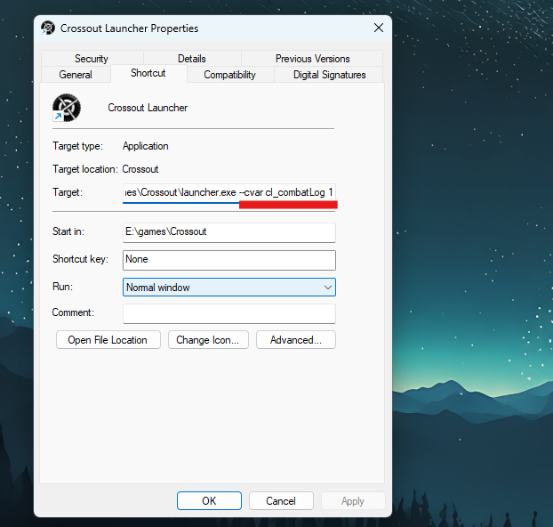
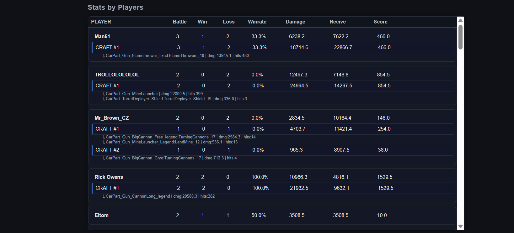
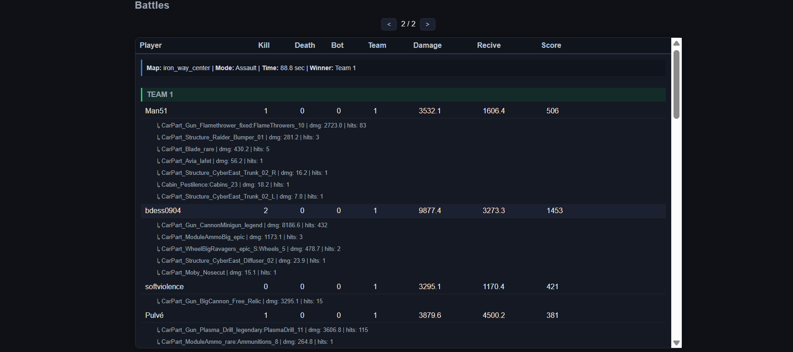
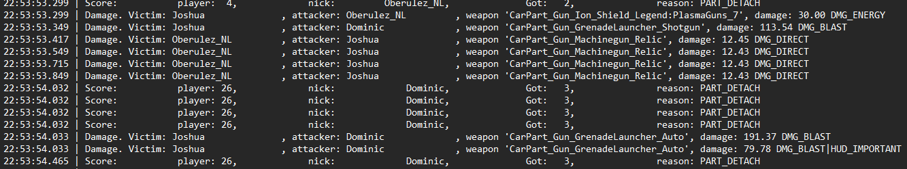

----------------------------------------How to run Program?---------------------------------------------------------

⚠️ **Demo video is available in the Releasessection of the repository.**


---

Before using the parser, you need to enable combat logs in Crossout.

---

## 1. Enable combat logs

Right-click the Crossout launcher shortcut:

```text id="v0b96q"
Properties → Target
```

Add one of these launch parameters:

```text id="8a9vhq"
--cvar cl_combatLog 1
```

If it does not work, try:

```text id="vtr8yq"
+set cl_combatLog 1
```

Example:



---

## 2. Start the game

Launch Crossout normally and enter the game.

The game will now start generating combat logs automatically.

---

## 3. Run the parser

Download:

```text id="t2dd6e"
release/Parser.exe
```

and run `Parser.exe`.

After launch, a console window will appear with two options:

```text id="9nwrdo"
1 - auto find latest log
2 - manual path
```

### Option 1

Automatically searches for the newest combat log:

```text id="x5a6e8"
C:\Users\{UserName}\AppData\Local\Targem\Crossout\logs\{DATE}
```

### Option 2

Allows you to manually enter the path to a specific log folder.

---

## 4. Open live statistics

After the parser starts:

* an HTML report is generated automatically,
* `stats.html` opens in the browser,
* statistics update after each battle.

Now you can simply alt-tab after a match and instantly view your battle statistics.


--------------------------------------Project Story & Development-------------------------------------------------


Crossout Battle Analyzer

📌 About the project

I wanted to build a project that actually means something to me and that I could use myself,
not just code for practice and forget about it.


I’ve always been interested in parsers because they are used in many real-world systems,
but I didn’t know where to get a good data source for practice.


While playing Crossout, I realized that the game already provides detailed battle logs. 
They were perfect for what I needed — raw, structured, and easy to analyze.
So I decided to build a tool that automatically parses these logs and turns them
into readable statistics so I can simply alt-tab after a match and see my performance.

________________________________________

🖥️ Dashboard preview





 
________________________________________

💡 Idea and motivation

The main idea started from curiosity:

 “Can I rebuild a full battle only from raw log events?”
 
 
Instead of manually checking results after each game, I wanted a system that:

    • reads logs automatically
    
    •	processes events in real time
    
    •	and generates clear statistics for each battle

________________________________________

⚙️ How I started

At the beginning I thought about:

    •	how to read and process logs,
    
    •	which tools and language to use,
    
    •	how to structure the data.


Since I study C language at university, it was the most natural choice for me.


Then I started designing the core logic:

    •	should I parse line by line or in blocks?
    
    •	how should I store events?
    
    •	how do I convert raw data into useful stats?


I decided to process the log line-by-line and convert each event into structured data stored in custom structs.
After that, everything is aggregated into final statistics.


🧠 Key idea

Each line in the log represents an event.


 

The program:

    •	reads the event
     
    •	identifies its type
     
    •	updates the corresponding structures
     
    •	recalculates statistics
    
    
After the battle ends, everything is saved and displayed in HTML format.

________________________________________

🔄 How it works (pipeline)

     Game Log File
                   ↓
     Line-by-line Parser
     
                   ↓
     Event Processing (damage, kills, score)
     
                   ↓
     Battle Structures (Player / Weapon / Battle)
                   ↓
     Global Statistics Aggregation
                   ↓
     HTML Report Generator
           
________________________________________

🧩 Program architecture (simplified)

Below is a simplified view of how the program works internally.

    
    /* ================= INIT PHASE ================= */
    
    allocate_battle_storage();
    
    initialize_global_statistics();
    
    open_or_find_combat_log();
    
    generate_empty_html_report();
    
    open_stats_in_browser();
    
    
    
    /* ================= MAIN LOOP ================= */
    
    while (read_line_from_log(file, line)) {
    
        Event event = parse_event(line);
    
    
    
        /* ===== GAME START ===== */
    
        if (event.type == GAMEPLAY_START) {
    
            create_new_battle();
    
            initialize_current_battle();
    
        }
    
    
    
        /* ===== GAME END ===== */
    
        else if (event.type == GAMEPLAY_END) {
    
            finalize_current_battle();
    
            update_global_statistics();
    
            save_battle_to_history();
    
            regenerate_html_report();
    
            switch_to_next_battle();
        }
    
    
    
        /* ===== NORMAL EVENT ===== */
    
        else {
    
            update_current_battle_data();
    
        }
    }
    
    
    
    /* ================= CLEANUP ================= */
    
    close_log_file();
    
    free_allocated_memory();

    
    

________________________________________

🚧 Challenges

The hardest part for me was starting the project from scratch without a clear plan. I didn’t have a predefined architecture, so I had to figure out the full idea and development direction step by step while building it.

I also had to manually find and fix issues with data output and saving, since I didn’t use separate debugging tools or frameworks — most problems were solved by analyzing program behavior directly.

In the middle of development I realized I needed proper version control, because I often wanted to return to previous states of the project. At that point I moved the entire project to Git, which significantly improved the development process.

________________________________________

🎯 Conclusion

This is an ongoing project, not a final version. I plan to keep improving it and make it more usable for other players.

The project started from curiosity and grew into a full log parsing system that reconstructs battles and shows player statistics.

It helped me improve my skills in:

•	data parsing

•	system design

•	memory management in C

•	building data pipelines


